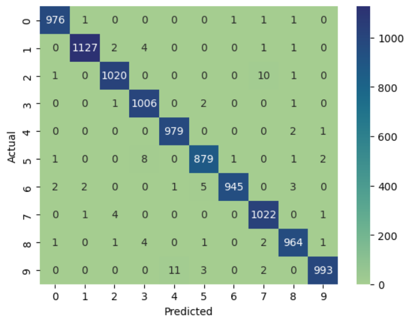
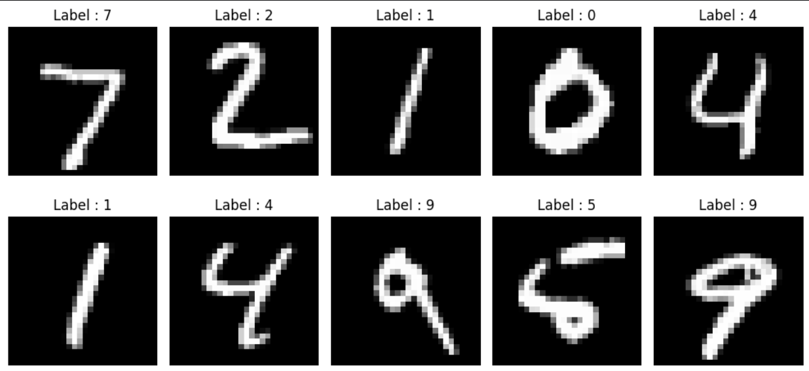

# Handwritten Digit Recognition using CNN

<p align="center">
  
</p>

A Convolutional Neural Network (CNN) built using **TensorFlow** and **Keras** to classify handwritten digits from the **MNIST** dataset.

**Test Accuracy:** **99.10%**

---

# Overview

This project demonstrates how Convolutional Neural Networks (CNNs) can automatically learn spatial features from images and accurately classify handwritten digits.

The model was trained on the MNIST dataset consisting of grayscale images of digits from **0–9**.

---

# Results

## Confusion Matrix

<p align="center">
  
</p>

The confusion matrix shows that the model correctly classifies the majority of handwritten digits with very few misclassifications.

---

## Sample Predictions

<p align="center">
  
</p>

The trained CNN successfully predicts handwritten digits from the test dataset.

---

# Dataset

Dataset: **MNIST**

- 60,000 Training Images
- 10,000 Testing Images
- Image Size: **28 × 28**
- Grayscale Images
- 10 Output Classes (0–9)

---

## 🏗️ Model Architecture

```text
Input (28×28×1)
      │
      ▼
Conv2D (32) + ReLU → MaxPool (2×2)
      │
      ▼
Conv2D (64) + ReLU → MaxPool (2×2)
      │
      ▼
Flatten → Dense (128) + ReLU
      │
      ▼
Dropout (0.2)
      │
      ▼
Output Layer (10 Classes, Softmax)
```

---

# Technologies Used

- Python
- TensorFlow
- Keras
- NumPy
- Matplotlib
- Seaborn

---

# Performance

| Metric | Value |
|---------|------:|
| Test Accuracy | **99.10%** |
| Training Accuracy | **99.61%** |
| Validation Accuracy | **99.10%** |

---

# Project Structure

```text
Handwritten-Digit-Recognition-CNN/
│
├── images/
│   ├── cover.png
│   ├── confusion_matrix.png
│   └── predictions.png
│
├── Handwritten_Digit_Recognition.ipynb
├── requirements.txt
└── README.md
```

---

# Installation

```bash
git clone https://github.com/yourusername/Handwritten-Digit-Recognition-CNN.git

cd Handwritten-Digit-Recognition-CNN

pip install -r requirements.txt
```

---

# Future Improvements

- Train on custom handwritten digits
- Deploy with Streamlit
- Apply Data Augmentation
- Compare with deeper CNN architectures

---

# Author

**Himanshu Pal**

If you found this project useful, feel free to ⭐ the repository.
